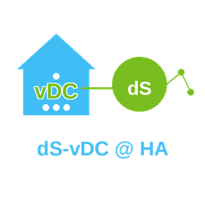

# dS-vDC @ HA

  

A Home Assistant custom integration that exposes existing HA entities as virtual digitalStrom devices (vdSDs) inside a connected digitalStrom system (DSS).

## What it does

`dsvdc4ha` acts as a **translation layer**, not a device driver. Real devices and their entities already exist in HA. This integration maps their values into the dS protocol so they can be monitored and controlled from within the DSS.

- Announces a `vdc-host` and a `vDC` to the DSS via pydsvdcapi and zero-conf
- Lets you define physical devices, each containing one or more vdSDs
- Maps HA entity state changes (inputs) and HA actions (output write-back) to dS callback variables
- Persists all configuration in HA config entries and restores fully on restart

## Installation

Install via [HACS](https://hacs.xyz/) by adding this repository as a custom integration repository.

## Setup

### 1 — Hub

On first "Add integration", enter the port the vDC host should listen on. The integration announces itself on the network and waits up to 2 minutes for a DSS to connect.

### 2 — Devices

After the hub is connected, use "Add device" to create virtual devices. Two creation paths are available:

#### Create from entity (recommended)

Pick an existing HA entity. The integration looks up its domain and device class in the built-in mapping table and automatically configures the correct dS output type, group, sensor function, and output channels. You are only asked to provide values where a genuine choice exists (e.g. indoor vs outdoor for blinds, or the exact sensor function for a multi-purpose binary sensor).

90 entity types are supported across 13 domains, including lights, covers/blinds, sensors, binary sensors, switches, fans, locks, and more.

#### Create from scratch

Full manual wizard for power users who need multi-vdSD devices or configurations not covered by the entity mapping. Walks through device info, one or more vdSDs, buttons, binary inputs, sensors, outputs, and channel bindings step by step.

## Notes

### Button devices

When a button entity (`button` domain or `event` with device class `button`) is created automatically via the entity or device path, it is always classified as a **Joker device in App-Mode (group 8)**. This is the safe default that works for any scene or app trigger without interfering with group-based lighting or shading control.

If you need the button to control a specific room group (e.g. Yellow — Light), change the group and function assignment afterwards in the **dSS Configurator** under *Device Properties* for that device.

## Requirements

- Home Assistant 2024.x or later
- [pydsvdcapi](https://pypi.org/project/pydsvdcapi/) (installed automatically via HACS)
- A digitalStrom server (DSS) on the same local network
